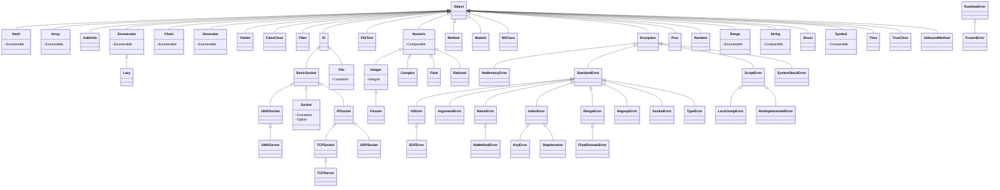

  
  

# Classes
| Name | Inherits | Includes | Description |
|---|---|---|---|
| Hash | Object | Enumerable | Associative Array |

# Modules
| Name | Description |
|---|---|
| Enumerable | |

# Inheritance Diagram

